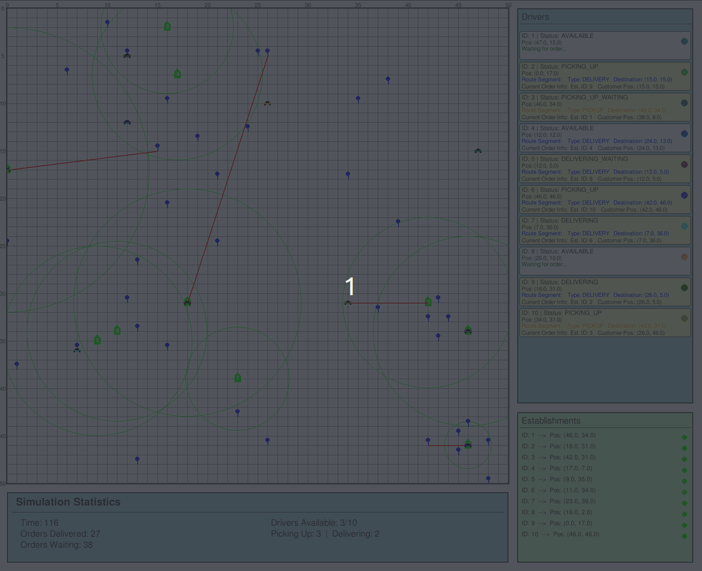

# Food Delivery Simulator

## 📋 Visão Geral

O **Food Delivery Simulator** é um simulador de entrega de comida desenvolvido utilizando a biblioteca de simulação de eventos discretos **SimPy**. O simulador foi adaptado para funcionar como um ambiente compatível com **Gymnasium**, permitindo experimentos com **Aprendizado por Reforço**. O objetivo é testar e treinar agentes utilizando algoritmos como **PPO (Proximal Policy Optimization)** da biblioteca **Stable-Baselines3**.



## 📋 Requisitos

- Python 3.6 ou superior
- Gymnasium
- SimPy
- Stable-Baselines3
- RL Baselines3 Zoo
- Outras dependências listadas em `requirements.txt`

## ⚙️ Configuração do Ambiente

### 1️⃣ Criar e ativar o ambiente virtual do Python

#### No Windows:
```shell
python -m venv venv
Set-ExecutionPolicy Unrestricted -Scope Process
.\venv\Scripts\activate
```

#### No Linux/Mac:
```shell
python -m venv venv
source venv/bin/activate
```

### 2️⃣ Instalar as dependências
```shell
python -m pip install -r requirements.txt
```

### 3️⃣ (Apenas no Linux) Instalar `python-tk` para usar o Matplotlib
```shell
sudo apt-get install python3-tk
```

## 🚀 Uso do Simulador

### 🔹 Sempre que for usar o script Python, ative o ambiente virtual:

#### No Windows:
```shell
Set-ExecutionPolicy Unrestricted -Scope Process
.\venv\Scripts\activate
```

#### No Linux/Mac:
```shell
source venv/bin/activate
```

### 🔹 Rodar o script do teste do simulador:
```shell
python -m food_delivery_gym.examples.test
```

## 🎯 Configuração dos Cenários Experimentais

O ambiente de simulação foi formulado como um Processo de Decisão de Markov (MDP) voltado ao problema de entrega de última milha. A seguir, listamos as principais constantes de configuração para a criação de cenários experimentais.

### 📊 Parâmetros Principais

| Variável             | Descrição                                                                                         |
|----------------------|---------------------------------------------------------------------------------------------------|
| `NUM_DRIVERS`        | Número total de motoristas disponíveis.                                                          |
| `NUM_ORDERS`         | Total de pedidos a serem gerados na simulação.                                                   |
| `NUM_ESTABLISHMENTS` | Quantidade de restaurantes ou estabelecimentos.                                                  |
| `NUM_COSTUMERS`      | Número de clientes. Deve ser igual ao número de pedidos.                                         |
| `GRID_MAP_SIZE`      | Tamanho do mapa da cidade (em um grid quadrado, por exemplo `50x50`).                            |
| `REWARD_OBJECTIVE`   | Define como as recompensas serão calculadas. Os valores possíveis vão de 1 a 10. Uma descrição dos possíveis `reward objectives` está disponível no arquivo `food_delivery_gym/main/scenarios/reward_objectives.txt` |
| `MAX_TIME_STEP`      | Tempo máximo da simulação (em minutos).                                                          |

### 📦 Geração de Pedidos

| Variável      | Descrição                                                                                          |
|---------------|----------------------------------------------------------------------------------------------------|
| `FUNCTION`    | Função lambda que define o número de pedidos gerados por passo de tempo. Deve ser passada como uma string. |
| `TIME_SHIFT`  | Intervalo de tempo (em minutos) entre criações de novos pedidos.                                  |

### 🚗 Configurações dos Motoristas

| Variável      | Descrição                                                                                          |
|---------------|----------------------------------------------------------------------------------------------------|
| `VEL_DRIVERS` | Lista com [mínimo, máximo] de velocidade dos motoristas. Ex.: `[3, 5]`.                          |

### 🏪 Configurações dos Estabelecimentos

| Variável              | Descrição                                                                                          |
|-----------------------|----------------------------------------------------------------------------------------------------|
| `PREPARE_TIME`        | Tempo de preparo dos pedidos: `[mínimo, máximo]` (em minutos).                                   |
| `OPERATING_RADIUS`    | Raio de operação dos estabelecimentos: `[mínimo, máximo]` (em unidades do grid).                 |
| `PRODUCTION_CAPACITY` | Capacidade de produção (número de cozinheiros): `[mínimo, máximo]`.                              |

### 🎛️ Alocação e Observações

| Variável                       | Descrição                                                                                          |
|--------------------------------|----------------------------------------------------------------------------------------------------|
| `PERCENTAGE_ALLOCATION_DRIVER` | Define o percentual de preparo necessário para acionar a alocação do motorista (ex.: `0.7`).     |
| `NORMALIZE`                    | Se `True`, normaliza as observações do estado para o intervalo `[0, 1]`.                         |

### 💾 Exemplo de Cenário Experimental

Para configurar um cenário experimental no ambiente de simulação, é necessário criar um arquivo JSON dentro do diretório `food_delivery_gym/main/scenarios` contendo todos os parâmetros desejados, como no exemplo abaixo:

```json
{
    "num_drivers": 10,
    "num_establishments": 10,
    "num_orders": 288,
    "num_costumers": 288,
    "grid_map_size": 50,
    "vel_drivers": [3, 5],
    "prepare_time": [20, 60],
    "operating_radius": [5, 30],
    "production_capacity": [4, 4],
    "percentage_allocation_driver": 0.7,
    "use_estimate": true,
    "desconsider_capacity": true,
    "max_time_step": 2880,
    "reward_objective": 1,
    "function_code": "lambda time: 2",
    "time_shift": 10,
    "normalize": false
}
```

Este exemplo define um cenário com 10 motoristas, 288 pedidos, 10 estabelecimentos e um ambiente de 50x50 unidades. Novos pedidos são criados a cada 10 minutos, 2 por vez.

### 📝 Registro do Cenário Experimental

Para registrar o cenário ambiental criado deve ser acessado o arquivo `food_delivery_gym/__init__.py`. No arquivo o cenário criado deve ser incluído seguindo o padrão observado e passando o nome do arquivo JSON criado anteriormente:

```python
register(
    id='food_delivery_gym/FoodDelivery-medium-obj1-v0',
    entry_point='food_delivery_gym.main.environment.food_delivery_gym_env:FoodDeliveryGymEnv',
    kwargs={
        "scenario_json_file_path": get_scenario_path("medium_obj1.json"),
    }
)
```

## 🤖 Treinamento de Agentes de Aprendizado por Reforço

Antes de iniciar o treinamento de agentes de Aprendizado por Reforço (AR), é necessário **definir um cenário experimental** a partir da seção anterior.

O processo de ajuste de hiperparâmetros e o treinamento será realizado utilizando a biblioteca [RL Baselines3 Zoo](https://github.com/DLR-RM/rl-baselines3-zoo), que fornece uma interface robusta para experimentação com algoritmos como PPO, DQN, A2C, entre outros.

### 1️⃣ Configuração do RL Baselines3 Zoo

Siga os passos abaixo para preparar o ambiente de treinamento:

**1º Passo**: Clone o repositório forkado do RL Baselines3 Zoo:

```bash
git clone https://github.com/MarquinhoCF/rl-baselines3-zoo.git
```

**2º Passo**: Entre na raiz do projeto `rl-baselines3-zoo`:

```bash
cd rl-baselines3-zoo
```

**3º Passo**: Crie e ative um ambiente virtual Python:

```bash
python -m venv venv
source venv/bin/activate  # No Windows, use: venv\Scripts\activate
```

**4º Passo**: Instale as dependências do Zoo:

```bash
python -m pip install -r requirements.txt
python -m pip install huggingface_hub huggingface_sb3 sb3-contrib
```

**5º Passo**: Navegue até o diretório do projeto `food_delivery_gym`:

```bash
cd ../food_delivery_gym/
```

**6º Passo**: Instale o pacote local:

```bash
python -m pip install .
```

**7º Passo**: Volte para o diretório do `rl-baselines3-zoo`:

```bash
cd ../rl-baselines3-zoo/
```

### 2️⃣ Ajuste de Hiperparâmetros (Opcional, mas Recomendado)

O ajuste de hiperparâmetros pode melhorar significativamente o desempenho do agente. Para realizar essa etapa:

**1º Passo**: Defina o número de passos de simulação e o número total de tentativas no processo de tuning.

**2º Passo**: Execute o seguinte comando, substituindo os valores dos parâmetros conforme necessário. No caso do exemplo abaixo estamos fazendo o ajuste de hiperparâmetros do Cenário Médio com objetivo de recompensa 1 em 1M de passos e 200 tentativas:

```bash
python train.py --algo ppo --env food_delivery_gym/FoodDelivery-medium-obj1-v0 \
--n-timesteps 1000000 --optimize-hyperparameters --max-total-trials 200 --n-jobs 2 \
--optimization-log-path logs/hyperparam_opt_ppo_food_delivery_medium_obj3/
```

### 3️⃣ Treinamento do Modelo

Com os hiperparâmetros definidos (via ajuste ou valores padrão), prossiga com o treinamento:

**1º Passo**: Utilize o arquivo YAML `/rl-baselines3-zoo/hyperparams/best_params_for_food_delivery_gym/ppo.yml` para definir os hiperparâmetros otimizados obtidos no passo anterior. Caso não tenha realizado o tuning, você pode usar os parâmetros padrão do `ppo`, disponíveis na [documentação oficial do Stable-Baselines3 Zoo](https://stable-baselines3.readthedocs.io/en/master/).

```yml
food_delivery_gym/FoodDelivery-medium-obj1-v0:
  n_timesteps: 18000000
  policy: 'MultiInputPolicy'
  n_envs: 4 
  learning_rate: 0.0009742009357947689
  ent_coef: 9.53697192932737e-07
  clip_range: 0.3
  n_steps: 256
  batch_size: 16
  n_epochs: 1
  gamma: 0.9912696235841435
  gae_lambda: 0.9936681407681269
  max_grad_norm: 1.92598340602166
  policy_kwargs: "dict(net_arch=dict(pi=[64], vf=[64]), activation_fn=nn.Tanh)"
  normalize: true
```

**2º Passo**: Defina o número total de passos de treinamento. Vamos definir 18M de passos como exemplo. Execute o treinamento:

```bash
python train.py --algo ppo --env food_delivery_gym/FoodDelivery-medium-obj1-v0 \
--conf hyperparams/best_params_for_food_delivery_gym/ppo.yml --n-timesteps 18000000
```

**3º Passo**: Visualize a curva de aprendizado:

```bash
python3 scripts/plot_train.py -a ppo -e FoodDelivery-medium-obj1-v0 -f logs/
```

## 🧩 Criação de Agentes Otimizadores com `OptimizerGym`

O pacote `food_delivery_gym` permite a criação de agentes otimizadores personalizados, baseados em heurísticas simples ou modelos treinados com Aprendizado por Reforço (AR), por meio da classe abstrata `OptimizerGym`.

Essa abordagem é útil para avaliar o desempenho de algoritmos customizados no ambiente de entrega de última milha e comparar com agentes baseados em AR.

Para desenvolver um novo agente deve herdar `OptimizerGym` e implementar o método `select_driver`.

### 🔧 Implementando um Otimizador Heurístico

A seguir, um exemplo de implementação do otimizador baseado na **distância ao motorista mais próximo**:

```python
from food_delivery_gym.main.optimizer.optimizer_gym.optmizer_gym import OptimizerGym
from food_delivery_gym.main.route.route import Route
from food_delivery_gym.main.driver.driver import Driver
from food_delivery_gym.main.map.map import Map
from typing import List

class NearestDriverOptimizerGym(OptimizerGym):
    def get_title(self):
        return "Otimizador do Motorista Mais Próximo"

    def compare_distance(self, map: Map, driver: Driver, route: Route):
        return map.distance(driver.get_last_coordinate_from_routes_list(), route.route_segments[0].coordinate)

    def select_driver(self, obs: dict, drivers: List[Driver], route: Route):
        nearest_driver = min(drivers, key=lambda driver: self.compare_distance(self.gym_env.simpy_env.map, driver, route))
        return drivers.index(nearest_driver)
```

### 🤖 Implementando um Otimizador com Modelo de AR (PPO)

Se você já treinou um modelo com o RL Baselines3 Zoo (como mostrado na seção anterior), pode integrá-lo diretamente:

```python
from stable_baselines3 import PPO
from food_delivery_gym.main.optimizer.optimizer_gym.optmizer_gym import OptimizerGym
from food_delivery_gym.main.route.route import Route
from food_delivery_gym.main.driver.driver import Driver
from typing import List, Union
import numpy as np

class RLModelOptimizerGym(OptimizerGym):
    def __init__(self, environment, model: PPO):
        super().__init__(environment)
        self.model = model

    def get_title(self):
        return "Otimizador por Aprendizado por Reforço"

    def select_driver(self, obs: dict, drivers: List[Driver], route: Route):
        action, _ = self.model.predict(obs, deterministic=True)
        return int(action) if isinstance(action, (int, np.integer)) else action.item()
```

### ▶️ Executando Simulações com o Otimizador

Com seu otimizador implementado, basta instanciá-lo e chamar:

```python
optimizer = NearestDriverOptimizerGym(env)
# ou
optimizer = RLModelOptimizerGym(env, trained_model)

optimizer.run_simulations(num_runs=10, dir_path="./resultados/", seed=42)
```

Isso executará múltiplas simulações, coletará estatísticas (recompensa, tempo de entrega, distância percorrida, etc.) e salvará os resultados em um arquivo `.txt` e `.npz`.

## 🧪 Execução em Lote de Otimizadores e Geração de Tabelas

Para facilitar a execução massiva de simulações e a geração de tabelas com os resultados dos agentes otimizadores (heurísticos e baseados em AR), o projeto fornece dois scripts utilitários:

### 🚀 Script `run_optimizer`: Execução de Múltiplos Otimizadores

Esse script automatiza a execução de diferentes agentes otimizadores em todos os **cenários experimentais** (`initial`, `medium`, `complex`) e para todos os **10 objetivos de recompensa**.

#### ✅ O que ele faz:

* Executa os seguintes agentes:
  * `RandomDriverOptimizerGym`
  * `FirstDriverOptimizerGym`
  * `NearestDriverOptimizerGym`
  * `LowestCostDriverOptimizerGym`
  * `RLModelOptimizerGym` (com diferentes checkpoints de modelos PPO treinados)
* Gera arquivos `.txt` com os resultados das execuções
* Gera arquivos `.npz` contendo as métricas agregadas para análise

#### 📦 Como usar:

Execute o comando:

```bash
python -m scripts.run_optimizer
```

> **Observação:** o script procura modelos PPO previamente treinados nos diretórios definidos em `MODEL_BASE_DIR`. Certifique-se de que os modelos `.zip` e arquivos `vecnormalize.pkl` estão no local correto para que o RL funcione.

### 📊 Script `generate_table`: Geração de Planilhas Excel com Métricas

Esse script consolida os resultados gerados pelo `run_optimizer` e preenche automaticamente um modelo Excel (`template_objective_table.xlsx`) com os dados das métricas estatísticas:

* **Recompensas**
* **Tempo efetivo de entrega**
* **Distância total percorrida**

#### ✅ O que ele faz:

* Para cada heurística e modelo PPO, em cada cenário e objetivo, extrai as métricas do arquivo `metrics_data.npz`
* Preenche as abas do Excel com média, desvio padrão, mediana e moda
* Gera um novo arquivo: `objective_table.xlsx`

#### 📦 Como usar:

1. Garanta que o script `run_optimizer` já foi executado e os arquivos `metrics_data.npz` foram gerados.
2. Certifique-se de ter o template em: `./templates/template_objective_table.xlsx`
3. Execute o comando:

```bash
python -m scripts.generate_table
```

> O Excel final será salvo com o nome `objective_table.xlsx` no diretório atual.