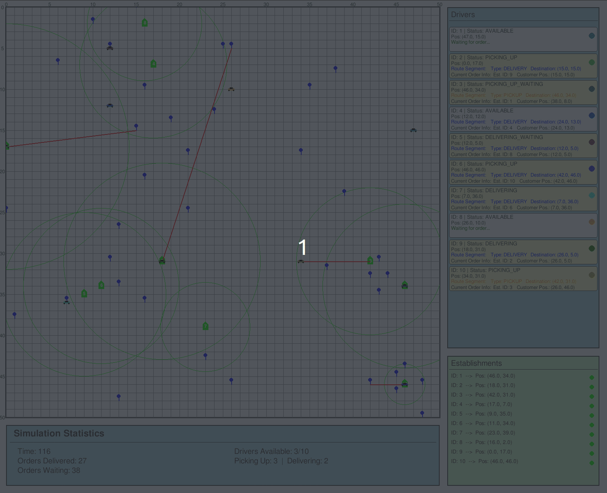

# Food Delivery Simulator

## 📋 Visão Geral

O **Food Delivery Simulator** é um simulador de entrega de comida desenvolvido utilizando a biblioteca de simulação de eventos discretos **SimPy**. O simulador foi adaptado para funcionar como um ambiente compatível com **Gymnasium**, permitindo experimentos com **Aprendizado por Reforço**. O objetivo é testar e treinar agentes utilizando algoritmos como **PPO (Proximal Policy Optimization)** da biblioteca **Stable-Baselines3**.



## 📋 Requisitos

- Python 3.10 ou superior
- Gymnasium
- SimPy
- Stable-Baselines3
- RL Baselines3 Zoo
- Outras dependências listadas em `requirements.txt`

## ⚙️ Configuração do Ambiente

### 1️⃣ Criar e ativar o ambiente virtual do Python

#### No Windows:
```shell
python -m venv venv
Set-ExecutionPolicy Unrestricted -Scope Process
.\venv\Scripts\activate
```

#### No Linux/Mac:
```shell
python3 -m venv venv
source venv/bin/activate
```

### 2️⃣ Instalar as dependências
```shell
python -m pip install -r requirements.txt
```

### 3️⃣ (Apenas no Linux) Instalar `python-tk` para usar o Matplotlib
```shell
sudo apt-get install python3-tk
```

### 4️⃣ Criar uma copia do exemplo de arquivo de ambiente
```shell
cp .env.example .env
```

## 🚀 Uso do Simulador

### 🔹 Sempre que for usar o script Python, ative o ambiente virtual:

#### No Windows:
```shell
Set-ExecutionPolicy Unrestricted -Scope Process
.\venv\Scripts\activate
```

#### No Linux/Mac:
```shell
source venv/bin/activate
```

### 🔹 Rodar o script do teste do simulador:

#### 1. **Modo Automático**
```shell
python -m scripts.test_runner --mode auto --scenario medium.json --render
```
- Executa automaticamente com ações aleatórias
- Útil para testes rápidos

#### 2. **Modo Interativo** (Recomendado para desenvolvimento)
```shell
python -m scripts.test_runner --mode interactive --scenario medium.json --render
```
- Executa passo-a-passo esperando sua entrada
- **Comandos disponíveis**:
  - `Enter`: ação aleatória
  - `run`: executa automaticamente até o fim
  - `quit`: sai do programa
  - Números/ações: entrada manual personalizada

#### 3. **Modo com Agente PPO** (Requer modelo treinado)
```shell
python -m scripts.test_runner --mode agent --scenario medium.json --model-path models/ppo_food_delivery --render
```

### ⚙️ Opções de Configuração

| Opção | Descrição | Exemplo |
|-------|-----------|---------|
| `--mode` | Modo de execução: `interactive`, `auto`, `agent` | `--mode interactive` |
| `--scenario` | Arquivo de cenário JSON | `--scenario medium.json` |
| `--optimizer` | Otimizador: `random`, `first`, `nearest`, `lowest`, `rl` | `--optimizer lowest` |
| `--objective` | Objetivo de recompensa do ambiente (1-10) | `--objective 1` |
| `--cost-function` | Função de custo usada pelo `lowest`: `route`, `marginal_route` | `--cost-function route` |
| `--render` | Ativa visualização gráfica | `--render` |
| `--seed` | Seed para reproducibilidade | `--seed 42` |
| `--max-steps` | Limite máximo de passos | `--max-steps 1000` |
| `--save-log` | Salva output em arquivo log.txt | `--save-log` |
| `--model-path` | Caminho para modelo PPO (modo agent) | `--model-path models/ppo_model` |

> A opção `--cost-function` é utilizada apenas quando `--optimizer lowest` está selecionado.

#### Exemplos:

##### Gerais:

```shell
# Execução automática simples (padrão: optimizer=random)
python -m scripts.test_runner --mode auto --max-steps 100

# Execução interativa com renderização
python -m scripts.test_runner --mode interactive --render

# Execução com seed fixa (reprodutibilidade)
python -m scripts.test_runner --mode auto --seed 123

# Executar com cenário específico
python -m scripts.test_runner --scenario medium.json --mode auto --render

# Executar salvando logs
python -m scripts.test_runner --mode auto --save-log

# Execução longa sem render
python -m scripts.test_runner --mode auto --max-steps 10000
```

##### Otimizadores:

```shell
# Otimizador aleatório
python -m scripts.test_runner --optimizer random --render

# Primeiro motorista disponível
python -m scripts.test_runner --optimizer first --render

# Motorista mais próximo
python -m scripts.test_runner --optimizer nearest --render

# Lowest cost com custo baseado na rota
python -m scripts.test_runner --optimizer lowest --cost-function route --render

# Lowest cost com custo marginal de rota
python -m scripts.test_runner --optimizer lowest --cost-function marginal_route --render
```

##### Objetivos de Recompensa:

```shell
# Objetivo baseado em tempo
python -m scripts.test_runner --optimizer lowest --objective 1 --render

# Objetivo baseado em distância
python -m scripts.test_runner --optimizer lowest --objective 2 --render
```

##### Combinações completas:

```shell
# Execução completa com todos parâmetros
python -m scripts.test_runner \
    --scenario medium.json \
    --mode auto \
    --optimizer lowest \
    --cost-function marginal_route \
    --objective 2 \
    --seed 42 \
    --max-steps 5000 \
    --save-log

# Debug interativo com lowest cost
python -m scripts.test_runner \
    --mode interactive \
    --optimizer lowest \
    --cost-function route \
    --render
```

## 🎯 Configuração dos Cenários Experimentais

O ambiente de simulação foi formulado como um **Processo de Decisão de Markov (MDP)** voltado ao **problema de entrega de última milha**.
A seguir são apresentadas as principais constantes e parâmetros utilizados na criação dos **cenários experimentais**.

### 📊 Parâmetros Principais

| Variável             | Descrição                                                             |
| -------------------- | --------------------------------------------------------------------- |
| `num_drivers`        | Número total de motoristas disponíveis.                               |
| `num_orders`         | Total de pedidos a serem gerados na simulação.                        |
| `num_establishments` | Quantidade de restaurantes ou estabelecimentos.                       |
| `grid_map_size`      | Tamanho do mapa da cidade (em um grid quadrado, por exemplo `50x50`). |
| `max_time_step`      | Tempo máximo da simulação (em minutos).                               |

---

### 📦 Geração de Pedidos (Processos de Poisson)

A criação de novos pedidos é controlada por um gerador configurável no campo `order_generator`.
Atualmente, o ambiente suporta dois tipos de geradores:

| Tipo                        | Classe Interna                                                                                   | Descrição                                                                     |
| --------------------------- | ------------------------------------------------------------------------------------------------ | ----------------------------------------------------------------------------- |
| `"poisson"`                 | `PoissonOrderGenerator` | Gera pedidos de forma homogênea com taxa constante λ.                         |
| `"non_homogeneous_poisson"` | `NonHomogeneousPoissonOrderGenerator` | Gera pedidos de forma não homogênea com taxa variável no tempo (função λ(t)). |

#### 🔹 Parâmetros Disponíveis

| Campo           | Descrição                                                                                                |
| --------------- | -------------------------------------------------------------------------------------------------------- |
| `type`          | Define o tipo de processo (`"poisson"` ou `"non_homogeneous_poisson"`).                                  |
| `time_window`   | Janela total de tempo da geração de pedidos (em minutos).                                                |
| `lambda_rate`   | Taxa média de chegada (λ) — usada apenas no gerador `"poisson"`. Não é necessária, caso não seja passado o sistema definirá a taxa como `num_orders/time_window`.  |
| `rate_function` | Função lambda que define a taxa variável de chegada λ(t) — usada no gerador `"non_homogeneous_poisson"`. |
| `max_rate`      | Taxa máxima usada para o método de *thinning* (necessária no gerador `"non_homogeneous_poisson"`).       |

#### 🔸 Exemplo — Processo de Poisson Homogêneo

```json
"order_generator": {
  "type": "poisson",
  "estimated_num_orders": 288,
  "time_window": 1440,
  "lambda_rate": 0.2
}
```

Nesse exemplo, pedidos são gerados de acordo com um **processo de Poisson homogêneo** com taxa média de **0,2 pedidos por minuto** durante um período de **1440 minutos** (1 dia).

#### 🔸 Exemplo — Processo de Poisson Não Homogêneo

```json
"order_generator": {
    "type": "non_homogeneous_poisson",
    "estimated_num_orders": 576,
    "time_window": 960,
    "rate_function": "lambda t: 0.3115 + 0.9345 * (np.exp(-((t - 330)**2) / 7000) + np.exp(-((t - 630)**2) / 7000))"
}
```

Neste caso, a taxa de geração de pedidos **varia ao longo do tempo** de forma senoidal, simulando períodos de alta e baixa demanda (por exemplo, picos no horário de almoço e jantar).

---

### 🚗 Configurações dos Motoristas

| Variável      | Descrição                                                                     |
| ------------- | ----------------------------------------------------------------------------- |
| `vel_drivers` | Lista com `[mínimo, máximo]` de velocidade dos motoristas. Exemplo: `[3, 5]`. |

---

### 🏪 Configurações dos Estabelecimentos

| Variável              | Descrição                                                                       |
| --------------------- | ------------------------------------------------------------------------------- |
| `prepare_time`        | Tempo de preparo dos pedidos `[mínimo, máximo]` (em minutos).                   |
| `operating_radius`    | Raio de operação dos estabelecimentos `[mínimo, máximo]` (em unidades do grid). |
| `production_capacity` | Capacidade de produção (número de cozinheiros) `[mínimo, máximo]`.              |

---

### 🎛️ Alocação

| Variável                       | Descrição                                                                               |
| ------------------------------ | --------------------------------------------------------------------------------------- |
| `percentage_allocation_driver` | Percentual de preparo necessário para acionar a alocação do motorista (exemplo: `0.7`). |

---

### 💾 Exemplo de Cenário Experimental

O cenário é configurado por um arquivo JSON dentro de
`food_delivery_gym/main/scenarios/`, como mostrado a seguir:

```json
{
    "order_generator": {
      "type": "poisson",
      "estimated_num_orders": 288,
      "time_window": 1440
    },
    "simpy_env": {
        "max_time_step": 2880
    },
    "grid_map": {
        "size": 50
    },
    "drivers" : {
        "num": 10,
        "vel": [3, 5],
        "tolerance_percentage": 50,
        "max_capacity": 2
    },
    "establishments": {
        "num": 10,
        "prepare_time": [20, 60],
        "operating_radius": [5, 30],
        "production_capacity": [4, 4],
        "percentage_allocation_driver": 0.7
    }
}
```

Esse cenário define:

* 10 motoristas e 10 estabelecimentos;
* 288 pedidos ao longo de 1440 minutos e tempo limite de 2880 minutos;
* geração de pedidos por **processo de Poisson homogêneo**.


### 📝 Registro do Cenário Experimental

Para registrar o cenário ambiental criado deve ser acessado o arquivo `food_delivery_gym/__init__.py`. No arquivo o cenário criado deve ser incluído seguindo o padrão observado, passando o nome do arquivo JSON criado anteriormente e definindo o objetivo de recompensas (como as recompensas serão calculadas):

Obs: Os valores possíveis dos `reward objectives` vão de 1 a 10. As descrições de cada objetivo estão disponíveis no arquivo `food_delivery_gym/main/scenarios/reward_objectives.txt`:

```python
register(
    id='food_delivery_gym/FoodDelivery-medium-obj1-v0',
    entry_point='food_delivery_gym.main.environment.food_delivery_gym_env:FoodDeliveryGymEnv',
    kwargs={
        "scenario_json_file_path": get_scenario_path("medium.json"),
        "reward_objective": 1
    }
)
```

## 🤖 Treinamento de Agentes de Aprendizado por Reforço

Antes de iniciar o treinamento de agentes de Aprendizado por Reforço (AR), é necessário **definir um cenário experimental** a partir da seção anterior.

O processo de ajuste de hiperparâmetros e o treinamento será realizado utilizando a biblioteca [RL Baselines3 Zoo](https://github.com/DLR-RM/rl-baselines3-zoo), que fornece uma interface robusta para experimentação com algoritmos como PPO, DQN, A2C, entre outros.

---

### 1️⃣ Configuração do RL Baselines3 Zoo

Siga os passos abaixo para preparar o ambiente de treinamento:

**1º Passo**: Clone o repositório forkado do RL Baselines3 Zoo:

```bash
git clone https://github.com/MarquinhoCF/rl-baselines3-zoo.git
```

**2º Passo**: Entre na raiz do projeto `rl-baselines3-zoo`:

```bash
cd rl-baselines3-zoo
```

**3º Passo**: Crie e ative um ambiente virtual Python:

```bash
python3 -m venv venv
source venv/bin/activate  # No Windows, use: venv\Scripts\activate
```

**4º Passo**: Instale as dependências do Zoo:

```bash
python -m pip install -r requirements.txt
python -m pip install huggingface_hub huggingface_sb3 sb3-contrib optuna rl_zoo3 seaborn scipy
```

**5º Passo**: Navegue até o diretório do projeto `food-delivery-gym`:

```bash
cd ../food-delivery-gym/
```

**6º Passo**: Instale o pacote local:

```bash
python -m pip -e install .
```

**7º Passo**: Volte para o diretório do `rl-baselines3-zoo`:

```bash
cd ../rl-baselines3-zoo/
```

---

### 2️⃣ Ajuste de Hiperparâmetros (Opcional, mas Recomendado)

O ajuste de hiperparâmetros usa o [Optuna](https://optuna.org/) para encontrar automaticamente a melhor configuração para o seu agente. Os resultados podem ser **salvos em um banco de dados SQLite**, permitindo que você **retome o estudo de onde parou** caso a execução seja interrompida.

#### 🔹 Comando básico com SQLite (recomendado)

```bash
python train.py \
  --algo ppo \
  --env food_delivery_gym/FoodDelivery-medium-obj1-v0 \
  --n-timesteps 1000000 \
  --optimize-hyperparameters \
  --max-total-trials 200 \
  --n-jobs 2 \
  --optimization-log-path logs/hyperparam_opt_ppo_food_delivery_medium_obj1/ \
  --storage sqlite:///optuna_studies.db \
  --study-name ppo_medium_obj1
```

#### 🔹 Retomando um estudo existente

Caso o processo seja interrompido, basta rodar o **mesmo comando novamente** com o mesmo `--storage` e `--study-name`. O Optuna detectará automaticamente o estudo salvo e continuará de onde parou, sem repetir trials já concluídos:

```bash
python train.py \
  --algo ppo \
  --env food_delivery_gym/FoodDelivery-medium-obj1-v0 \
  --n-timesteps 1000000 \
  --optimize-hyperparameters \
  --max-total-trials 200 \
  --n-jobs 2 \
  --optimization-log-path logs/hyperparam_opt_ppo_food_delivery_medium_obj1/ \
  --storage sqlite:///optuna_studies.db \
  --study-name ppo_medium_obj1
```

> ✅ **Dica:** Salve cada cenário/objetivo com um `--study-name` diferente no mesmo banco de dados. Por exemplo: `ppo_medium_obj1`, `ppo_medium_obj2`, `ppo_complex_obj1`, etc.

#### 📋 Parâmetros explicados

| Parâmetro | Descrição |
|-----------|-----------|
| `--algo ppo` | Algoritmo de AR a ser usado. Outros suportados: `a2c`, `dqn`, `sac`, `td3`. |
| `--env` | ID do ambiente Gymnasium registrado no pacote `food_delivery_gym`. |
| `--n-timesteps` | Número de passos de simulação por trial durante a otimização. Valores maiores são mais precisos, porém mais lentos. |
| `--optimize-hyperparameters` | Ativa o modo de busca automática de hiperparâmetros via Optuna. |
| `--max-total-trials` | Número máximo de tentativas (trials) que o Optuna vai explorar. Mais trials = melhor resultado, porém mais tempo. |
| `--n-jobs` | Número de trials executados em paralelo. Depende dos núcleos disponíveis na sua máquina. |
| `--optimization-log-path` | Diretório onde serão salvos os logs e checkpoints dos modelos avaliados durante a otimização. |
| `--storage` | URI do banco de dados onde o estudo Optuna será persistido. Use `sqlite:///nome_do_arquivo.db` para SQLite local. |
| `--study-name` | Nome único do estudo no banco de dados. Permite múltiplos estudos no mesmo arquivo `.db` e retomada após interrupção. |

#### 🔹 Exemplos adicionais

```bash
# Otimização rápida para testes (poucos trials, poucos steps)
python train.py \
  --algo ppo \
  --env food_delivery_gym/FoodDelivery-medium-obj1-v0 \
  --n-timesteps 100000 \
  --optimize-hyperparameters \
  --max-total-trials 20 \
  --n-jobs 1 \
  --storage sqlite:///optuna_studies.db \
  --study-name ppo_medium_obj1_quick

# Otimização de cenário complexo com objetivo 2
python train.py \
  --algo ppo \
  --env food_delivery_gym/FoodDelivery-complex-obj2-v0 \
  --n-timesteps 1000000 \
  --optimize-hyperparameters \
  --max-total-trials 200 \
  --n-jobs 4 \
  --optimization-log-path logs/hyperparam_opt_ppo_food_delivery_complex_obj2/ \
  --storage sqlite:///optuna_studies.db \
  --study-name ppo_complex_obj2
```

#### 🔍 Inspecionando o banco de dados do Optuna

Você pode visualizar e consultar os estudos salvos diretamente pelo Python:

```python
import optuna

# Listar todos os estudos no banco
studies = optuna.get_all_study_names("sqlite:///optuna_studies.db")
print(studies)

# Carregar e inspecionar um estudo específico
study = optuna.load_study(
    study_name="ppo_medium_obj1",
    storage="sqlite:///optuna_studies.db"
)

print(f"Número de trials concluídos: {len(study.trials)}")
print(f"Melhor valor: {study.best_value}")
print(f"Melhores parâmetros:\n{study.best_params}")
```

Alternativamente, use o **dashboard do Optuna** para visualização interativa:

```bash
pip install optuna-dashboard
optuna-dashboard sqlite:///optuna_studies.db
```

Acesse no navegador: `http://localhost:8080`

---

### 3️⃣ Treinamento do Modelo

Com os hiperparâmetros definidos (via ajuste ou valores padrão), prossiga com o treinamento.

**1º Passo**: Defina os hiperparâmetros no arquivo YAML `hyperparams/best_params_for_food_delivery_gym/ppo.yml`. Se realizou o tuning, use os melhores parâmetros encontrados. Caso contrário, os parâmetros padrão do PPO estão disponíveis na [documentação oficial do Stable-Baselines3 Zoo](https://stable-baselines3.readthedocs.io/en/master/).

```yml
food_delivery_gym/FoodDelivery-medium-obj1-v0:
  n_timesteps: 18000000
  policy: 'MultiInputPolicy'
  n_envs: 4
  learning_rate: 0.0009742009357947689
  ent_coef: 9.53697192932737e-07
  clip_range: 0.3
  n_steps: 256
  batch_size: 16
  n_epochs: 1
  gamma: 0.9912696235841435
  gae_lambda: 0.9936681407681269
  max_grad_norm: 1.92598340602166
  policy_kwargs: "dict(net_arch=dict(pi=[64], vf=[64]), activation_fn=nn.Tanh)"
  normalize: true
```

**2º Passo**: Execute o treinamento. O comando abaixo **salva checkpoints e permite retomada** via `--storage` e `--study-name`:

```bash
python train.py \
  --algo ppo \
  --env food_delivery_gym/FoodDelivery-medium-obj1-v0 \
  --conf hyperparams/best_params_for_food_delivery_gym/ppo.yml \
  --n-timesteps 18000000 \
  --log-folder logs/training/
```

#### 🔁 Retomando um treinamento interrompido

Se o treinamento for interrompido (queda de energia, erro, etc.), localize o último checkpoint salvo na pasta de logs e use `--load-best-trial` ou especifique o modelo diretamente:

```bash
# Retomar a partir do checkpoint mais recente salvo em logs/
python train.py \
  --algo ppo \
  --env food_delivery_gym/FoodDelivery-medium-obj1-v0 \
  --conf hyperparams/best_params_for_food_delivery_gym/ppo.yml \
  --n-timesteps 18000000 \
  --log-folder logs/training/ \
  --trained-agent logs/training/ppo/FoodDelivery-medium-obj1-v0_1/best_model.zip
```

#### 📋 Parâmetros de treinamento explicados

| Parâmetro | Descrição |
|-----------|-----------|
| `--algo ppo` | Algoritmo utilizado para o treinamento. |
| `--env` | ID do ambiente registrado. |
| `--conf` | Caminho para o arquivo YAML com os hiperparâmetros. |
| `--n-timesteps` | Total de passos de treinamento. Quanto mais passos, maior o tempo e potencialmente melhor o agente. |
| `--log-folder` | Diretório onde os logs, checkpoints e o modelo final serão salvos. |
| `--storage` | Banco de dados SQLite para registro do experimento. |
| `--study-name` | Nome do estudo para identificar este treinamento no banco. |
| `--trained-agent` | Caminho para um modelo `.zip` já treinado, para **continuar o treinamento** a partir de um checkpoint. |
| `--n-eval-episodes` | Número de episódios usados para avaliar o agente durante o treinamento (padrão: 5). |
| `--eval-freq` | Frequência (em passos) com que o agente é avaliado e um checkpoint é salvo. |
| `--save-freq` | Frequência (em passos) para salvar checkpoints intermediários. |
| `--verbose` | Nível de verbosidade: `0` = silencioso, `1` = informações básicas, `2` = detalhado. |
| `--seed` | Seed para reprodutibilidade dos experimentos. |

#### 🔹 Exemplos adicionais de treinamento

```bash
# Treinamento com avaliação frequente e seed fixo (reprodutibilidade)
python train.py \
  --algo ppo \
  --env food_delivery_gym/FoodDelivery-medium-obj1-v0 \
  --conf hyperparams/best_params_for_food_delivery_gym/ppo.yml \
  --n-timesteps 18000000 \
  --eval-freq 50000 \
  --n-eval-episodes 10 \
  --seed 42 \
  --log-folder logs/training/

# Treinamento com salvamento frequente de checkpoints
python train.py \
  --algo ppo \
  --env food_delivery_gym/FoodDelivery-medium-obj1-v0 \
  --conf hyperparams/best_params_for_food_delivery_gym/ppo.yml \
  --n-timesteps 18000000 \
  --save-freq 500000 \
  --log-folder logs/training/

# Treinamento com parâmetros padrão (sem arquivo YAML)
python train.py \
  --algo ppo \
  --env food_delivery_gym/FoodDelivery-medium-obj1-v0 \
  --n-timesteps 5000000 \
  --log-folder logs/training/
```

**3º Passo**: Visualize a curva de aprendizado após o treinamento:

```bash
python scripts/plot_train.py -a ppo -e FoodDelivery-medium-obj1-v0 -f logs/training/
```

---

### 4️⃣ Dicas Gerais de Uso do RL Baselines3 Zoo

- **Organize os estudos por nome**: Use nomes descritivos como `ppo_medium_obj1_run1` para facilitar a rastreabilidade entre múltiplos experimentos.
- **Use o mesmo banco SQLite para tudo**: Centralizar todos os estudos (tuning e treinamento) em um único `optuna_studies.db` facilita comparações e consultas.
- **Sempre salve com `--storage`**: Mesmo para experimentos curtos, a persistência no banco de dados protege contra perdas inesperadas.
- **Verifique os logs regularmente**: O TensorBoard pode ser usado para acompanhar métricas em tempo real:

```bash
tensorboard --logdir logs/training/
```

Acesse em: `http://localhost:6006`

## 🧩 Criação de Agentes Otimizadores com `OptimizerGym`

O pacote `food_delivery_gym` permite a criação de agentes otimizadores personalizados, baseados em heurísticas simples ou modelos treinados com Aprendizado por Reforço (AR), por meio da classe abstrata `OptimizerGym`.

Essa abordagem é útil para avaliar o desempenho de algoritmos customizados no ambiente de entrega de última milha e comparar com agentes baseados em AR.

Para desenvolver um novo agente deve herdar `OptimizerGym` e implementar o método `select_driver`.

### 🔧 Implementando um Otimizador Heurístico

A seguir, um exemplo de implementação do otimizador baseado na **distância ao motorista mais próximo**:

```python
from food_delivery_gym.main.optimizer.optimizer_gym.optmizer_gym import OptimizerGym
from food_delivery_gym.main.route.route import Route
from food_delivery_gym.main.driver.driver import Driver
from food_delivery_gym.main.map.map import Map
from typing import List

class NearestDriverOptimizerGym(OptimizerGym):
    def get_title(self):
        return "Otimizador do Motorista Mais Próximo"

    def compare_distance(self, map: Map, driver: Driver, route: Route):
        return map.distance(driver.get_last_valid_coordinate(), route.route_segments[0].coordinate)

    def select_driver(self, obs: dict, drivers: List[Driver], route: Route):
        nearest_driver = min(drivers, key=lambda driver: self.compare_distance(self.gym_env.simpy_env.map, driver, route))
        return drivers.index(nearest_driver)
```

### 🤖 Implementando um Otimizador com Modelo de AR (PPO)

Se você já treinou um modelo com o RL Baselines3 Zoo (como mostrado na seção anterior), pode integrá-lo diretamente:

```python
from stable_baselines3 import PPO
from food_delivery_gym.main.optimizer.optimizer_gym.optmizer_gym import OptimizerGym
from food_delivery_gym.main.route.route import Route
from food_delivery_gym.main.driver.driver import Driver
from typing import List, Union
import numpy as np

class RLModelOptimizerGym(OptimizerGym):
    def __init__(self, environment, model: PPO):
        super().__init__(environment)
        self.model = model

    def get_title(self):
        return "Otimizador por Aprendizado por Reforço"

    def select_driver(self, obs: dict, drivers: List[Driver], route: Route):
        action, _ = self.model.predict(obs, deterministic=True)
        return int(action) if isinstance(action, (int, np.integer)) else action.item()
```

### ▶️ Executando Simulações com o Otimizador

Com seu otimizador implementado, basta instanciá-lo e chamar:

```python
optimizer = NearestDriverOptimizerGym(env)
# ou
optimizer = RLModelOptimizerGym(env, trained_model)

optimizer.run_simulations(num_runs=10, dir_path="./resultados/", seed=42)
```

Isso executará múltiplas simulações, coletará estatísticas (recompensa, tempo de entrega, distância percorrida, etc.) e salvará os resultados em um arquivo `.txt` e `.npz`.

## 🧪 Execução em Lote de Otimizadores e Geração de Tabelas

Para facilitar a execução massiva de simulações e a geração de tabelas com os resultados dos agentes otimizadores (heurísticos e baseados em AR), o projeto fornece dois scripts utilitários:

### 🚀 Script `run_batch_eval`: Execução de Múltiplos Otimizadores

Esse script automatiza a execução de diferentes agentes otimizadores em combinações de cenários experimentais e objetivos de recompensa.

#### ✅ O que ele faz:

* Executa os seguintes agentes heurísticos:
  * `RandomDriverOptimizerGym`
  * `FirstDriverOptimizerGym`
  * `NearestDriverOptimizerGym`
  * `LowestCostDriverOptimizerGym` (com custo de rota)
  * `LowestCostDriverOptimizerGym` (com custo marginal de rota)
* Executa modelos PPO (`RLModelOptimizerGym`), com **descoberta automática** dos modelos disponíveis em `--model-base-dir`
* Gera arquivos `.txt` com os resultados das execuções
* Gera arquivos `.npz` contendo as métricas agregadas para análise

#### 📦 Como usar:

Execução padrão (todos os objetivos, cenários, heurísticas e modelos disponíveis):

```bash
python -m scripts.run_batch_eval
```

#### ⚙️ Opções de Configuração

| Opção | Descrição | Padrão |
|-------|-----------|--------|
| `--objectives` / `-o` | Objetivos de recompensa a executar (1–13). Aceita múltiplos valores. | todos (1–13) |
| `--scenarios` / `-s` | Cenários a executar: `initial`, `medium`, `complex`. Aceita múltiplos valores. | todos |
| `--heuristics` | Heurísticas a executar. Aceita múltiplos valores. | todas |
| `--models` / `-m` | Nomes dos modelos RL (subdiretórios de `obj_N/` com `best_model.zip`). Ver estrutura de diretórios abaixo. | descoberta automática |
| `--no-heuristics` | Desativa a execução de todas as heurísticas. | — |
| `--no-rl` | Desativa a execução dos modelos PPO. | — |
| `--num-runs` / `-n` | Número de simulações por agente. | `20` |
| `--seed` | Seed para reprodutibilidade. | `123456789` |
| `--model-base-dir` | Diretório base dos modelos PPO treinados. | `./data/ppo_training/.../treinamento` |
| `--results-base-dir` | Diretório base para salvar resultados. Use `{}` como placeholder para objetivo e cenário. | `./data/runs/execucoes/obj_{}/{}_scenario/` |
| `--save-log` | Salva o output em `log.txt` dentro do diretório de resultados. | — |

Os valores possíveis para `--heuristics` são: `random`, `first_driver`, `nearest_driver`, `lowest_route_cost`, `lowest_marginal_route_cost`.

#### 📁 Estrutura de diretórios para modelos RL

O script descobre automaticamente os modelos disponíveis varrendo `--model-base-dir`. Para que um modelo seja reconhecido, os arquivos devem estar organizados da seguinte forma:

```
<model-base-dir>/
└── obj_1/
│   ├── 18M_steps/
│   │   ├── best_model.zip
│   │   └── food_delivery_gym-FoodDelivery-medium-obj1-v0/
│   │       └── vecnormalize.pkl
│   └── outro_experimento/
│       ├── best_model.zip
│       └── food_delivery_gym-FoodDelivery-medium-obj1-v0/
│           └── vecnormalize.pkl
└── obj_2/
    └── ...
```

As regras são:

* Cada objetivo deve ter seu próprio subdiretório `obj_N/` dentro de `--model-base-dir`
* Dentro de `obj_N/`, qualquer subdiretório que contenha `best_model.zip` na raiz é detectado como um modelo — o nome do subdiretório se torna o identificador do modelo nos resultados
* O `vecnormalize.pkl` deve estar no caminho `<modelo>/food_delivery_gym-FoodDelivery-medium-obj{N}-v0/vecnormalize.pkl`. Se um vecnormalize.pkl for encontrado em qualquer subdiretório do modelo, ele é carregado automaticamente. Caso contrário, o modelo é executado sem normalização. 

> **Observação:** se os modelos foram treinados com o RL Baselines3 Zoo sem mover os arquivos gerados, a estrutura já estará no formato correto automaticamente. Use `--models` apenas para restringir a execução a modelos específicos dentro de `obj_N/`.

#### 🔹 Exemplos

```bash
# Rodar apenas heurísticas, sem PPO
python -m scripts.run_batch_eval --no-rl

# Rodar apenas os modelos PPO, sem heurísticas
python -m scripts.run_batch_eval --no-heuristics

# Cenário e objetivo específicos
python -m scripts.run_batch_eval --scenarios medium --objectives 1 3 5

# Selecionar heurísticas específicas
python -m scripts.run_batch_eval --heuristics random nearest_driver

# Forçar modelos RL específicos (sem descoberta automática)
python -m scripts.run_batch_eval --models 18M_steps 100M_steps

# Execução rápida
python -m scripts.run_batch_eval --num-runs 5 --seed 42 --scenarios initial --objectives 1

# Execução completa salvando logs e usando diretórios customizados
python -m scripts.run_batch_eval \
    --model-base-dir ./meus_modelos \
    --results-base-dir ./resultados/obj_{}/{}_scenario/ \
    --save-log
```

---

### 📊 Script `generate_table`: Geração de Planilhas Excel com Métricas

Esse script consolida os resultados gerados pelo `run_batch_eval` e gera automaticamente a planilha Excel com as métricas estatísticas de todos os agentes.

#### ✅ O que ele faz:

* Varre o diretório de resultados e **descobre automaticamente** todos os agentes presentes — sem mapeamentos manuais de colunas
* Organiza os agentes em ordem: heurísticas conhecidas primeiro, modelos PPO em seguida (ordem alfabética)
* Gera o Excel do zero com estrutura dinâmica: novas heurísticas ou modelos PPO geram colunas novas automaticamente
* Preenche três abas com média, desvio padrão, mediana e moda:
  * **Recompensas**
  * **Tempo Efetivo Gasto**
  * **Distância Percorrida**
* Destaca em negrito o melhor agente por cenário/objetivo em cada aba (maior média em Recompensas; menor nas demais)
* Gera um novo arquivo: `objective_table.xlsx`

#### 📦 Como usar:

Garanta que o script `run_batch_eval` já foi executado e os arquivos `metrics_data.npz` foram gerados, então execute:

```bash
python -m scripts.generate_table
```

#### ⚙️ Opções de Configuração

| Opção | Descrição | Padrão |
|-------|-----------|--------|
| `--results-dir` / `-r` | Diretório raiz com os resultados (`obj_N/`). | `./data/runs/execucoes` |
| `--output` / `-out` | Caminho do arquivo Excel de saída. | `objective_table.xlsx` |
| `--objectives` / `-o` | Objetivos a incluir (1–13). Aceita múltiplos valores. | todos (1–13) |
| `--scenarios` / `-s` | Cenários a incluir: `initial`, `medium`, `complex`. Aceita múltiplos valores. | todos |

#### 🔹 Exemplos

```bash
# Padrão — gera tabela com todos os dados disponíveis
python -m scripts.generate_table

# Diretório e arquivo de saída customizados
python -m scripts.generate_table \
    --results-dir ./data/runs/execucoes \
    --output ./resultados/minha_tabela.xlsx

# Apenas objetivos e cenários específicos
python -m scripts.generate_table --objectives 1 3 5 --scenarios initial medium
```