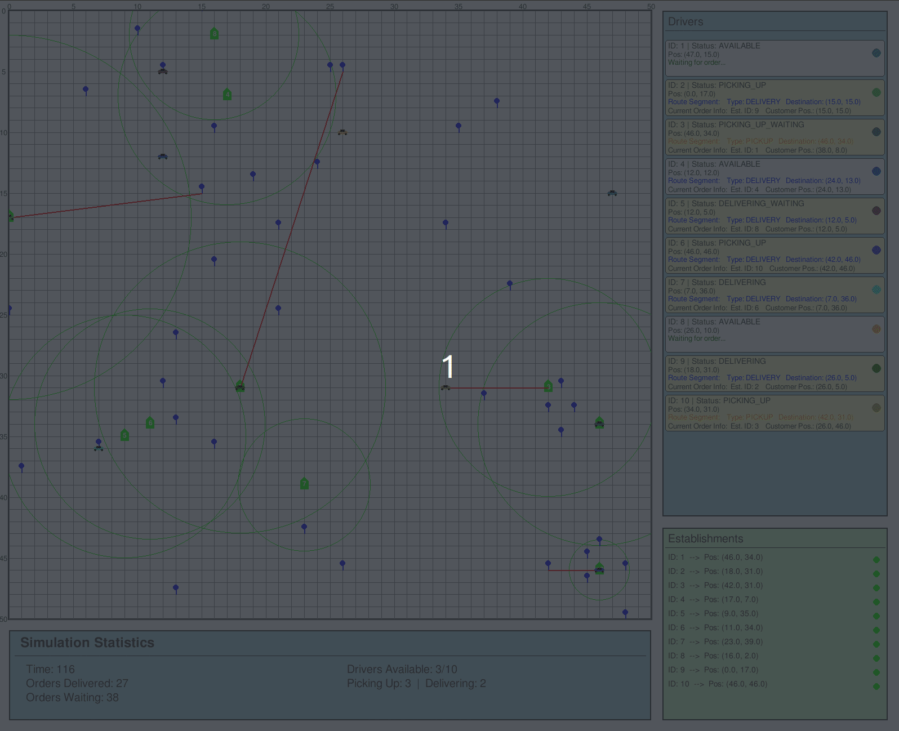

# Food Delivery Gym

Simulador de entrega de última milha baseado em **SimPy**, exposto como ambiente **Gymnasium** para experimentos com heurísticas e aprendizado por reforço (PPO / Stable-Baselines3).

O projeto formaliza a alocação dinâmica de motoristas como um Processo de Decisão de Markov, oferece cenários experimentais configuráveis e um conjunto de ferramentas para avaliação em lote, relatórios e figuras.

---

## Publicação no SBPO 2026

Este trabalho foi **aprovado** para o **LVIII Simpósio Brasileiro de Pesquisa Operacional (SBPO 2026)**, na categoria Trabalho Completo (Oral), no eixo temático **L&T - Logística e Transportes** (com submissão também no eixo **IA - PO e IA**).

| Item | Informação |
|------|------------|
| **Título** | *Entrega de Última Milha sob Incerteza: Simulação e Solução com Aprendizado por Reforço e Heurísticas* |
| **Autores** | Marcos Carvalho Ferreira, Julio César Alves, Dilson Lucas Pereira |
| **Instituição** | Universidade Federal de Lavras (UFLA) |
| **Evento** | LVIII Simpósio Brasileiro de Pesquisa Operacional (SBPO 2026) |
| **Categoria** | Trabalho Completo (Apresentação Oral) |
| **Eixo Temático Principal** | L&T - Logística e Transportes |
| **Segundo Eixo Temático** | IA - PO e IA |
| **DOI** | *A ser adicionado após publicação nos anais.* |
| **Artigo** | *A ser adicionado após publicação nos anais.* |

### Resumo

A entrega de última milha em cenários de demanda estocástica impõe desafios à logística urbana, sobretudo na alocação eficiente de motoristas em tempo real. Este trabalho investiga a aplicação do algoritmo Proximal Policy Optimization (PPO) e de heurísticas ao problema de alocação dinâmica de motoristas, formalizado como Processo de Decisão de Markov. Entre as contribuições estão a formalização do problema, um simulador modular de eventos discretos e a comparação sistemática entre heurísticas e agentes PPO em cenários de complexidade crescente. O PPO com otimização de hiperparâmetros supera as heurísticas nos cenários de maior demanda, com reduções de 20% e 55% no tempo efetivo de entrega.

**Palavras-chave:** Aprendizado por Reforço, Entrega de Última Milha, Roteamento Dinâmico de Veículos.

### Dados experimentais

Os dados brutos usados para gerar as figuras e tabelas do artigo estão disponíveis no Google Drive. Não é necessário reexecutar as simulações para inspecionar os resultados.

- **Link:** [Dados do Artigo](https://drive.google.com/drive/folders/1LPtYEpgLncWMga_ysa0-UeE2ng3i0UxC?usp=sharing)

O acesso ao diretório de dados é concedido mediante solicitação pelo Google Drive.

Para um guia completo voltado a revisores, consulte [Reprodução dos resultados do SBPO](docs/experiments/reproducing-sbpo.md).

---

## Documentação

A documentação completa está organizada em [`docs/`](docs/README.md).

| Seção | Conteúdo |
|-------|----------|
| [Começando](docs/getting-started/installation.md) | Instalação, ambientes e início rápido |
| [Framework](docs/framework/overview.md) | Simulador, cenários, recompensas e otimizadores |
| [Experimentos](docs/experiments/yaml.md) | YAML, avaliação em lote e layout de dados |
| [Ferramentas](docs/tools/test-runner.md) | Scripts CLI desenvolvidos neste repositório |
| [RL Baselines3 Zoo](docs/rl-baselines3-zoo/README.md) | Treinamento PPO, Optuna e artefatos |
| [Referência](docs/reference/cli-cheatsheet.md) | Comandos rápidos e convenções |

### Trilhas de leitura

| Perfil | Ordem sugerida |
|--------|----------------|
| Revisor / reprodução do artigo | [Reprodução SBPO](docs/experiments/reproducing-sbpo.md) → [Layout de dados](docs/experiments/data-layout.md) → [generate_table](docs/tools/generate-table.md) / [generate_boxplots](docs/tools/generate-boxplots.md) |
| Usuário do simulador | [Instalação](docs/getting-started/installation.md) → [Início rápido](docs/getting-started/quickstart.md) → [test_runner](docs/tools/test-runner.md) |
| Experimentos em lote | [YAML](docs/experiments/yaml.md) → [run_batch_eval](docs/tools/run-batch-eval.md) → [report](docs/tools/report.md) |
| Treinamento PPO | [Cenários](docs/framework/scenarios.md) → [RL Baselines3 Zoo](docs/rl-baselines3-zoo/README.md) → [Avaliação](docs/tools/run-batch-eval.md) |

---

## Principais capacidades

- Ambiente Gymnasium com IDs `FoodDelivery-{cenário}-obj{N}-v1`
- Cenários experimentais em JSON (demanda Poisson homogênea ou não homogênea)
- Treze objetivos de recompensa
- Catálogo de heurísticas (`random`, `first_driver`, `nearest_driver`, `lowest`, `rollout`) e modelos PPO
- Avaliação em lote com YAML versionável e retomada automática
- Geração de planilhas, boxplots e gráficos a partir dos artefatos salvos
- Integração com o fork [rl-baselines3-zoo](https://github.com/MarquinhoCF/rl-baselines3-zoo) para treino e Optuna

---

## Licença e links

- Licença: [MIT](LICENSE)
- Repositório: [github.com/MarquinhoCF/food-delivery-gym](https://github.com/MarquinhoCF/food-delivery-gym)
- Versão do pacote: `1.2.7` (ver [`pyproject.toml`](pyproject.toml))
