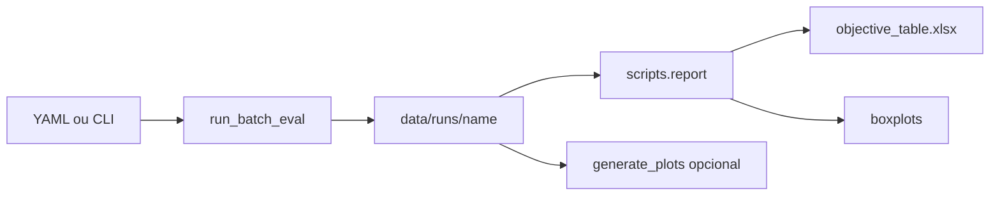

# Avaliação em lote

Este é o fluxo recomendado para experimentos e comparações sistemáticas no código atual.

## Pipeline



1. Defina o experimento ([YAML](yaml.md)).
2. Execute `python -m scripts.run_batch_eval ...`.
3. Gere o relatório: `python -m scripts.report data/runs/<name>`.
4. Se necessário, refine figuras com `generate_plots`, `generate_boxplots` ou `generate_table`.

## O que o batch eval produz

Em `data/runs/<name>/`:

| Artefato | Conteúdo |
|----------|----------|
| `run.json` | Spec resolvida, versão do pacote, commit |
| `summary.csv` | Resumo consolidado |
| `obj_N/<cenário>/<agente>/episodes.csv` | Métricas por episódio |
| `obj_N/<cenário>/<agente>/metrics_data.npz` | Métricas estruturadas (ou `.json`) |
| `obj_N/<cenário>/<agente>/summary.json` | Resumo do agente |
| `figs/` | Se `--batch-plots` ou `--all-plots` |

## Retomada

Se `metrics_data.npz` (ou equivalente) já existir e abrir corretamente, aquele agente é **pulado**. Isso permite retomar execuções interrompidas sem apagar progresso.

## Modos RL

| Modo | Comportamento |
|------|----------------|
| `cross_scenario` | Usa modelos treinados em `--train-scenario` para avaliar em todos os cenários |
| `same_scenario` | Usa o modelo treinado no próprio cenário de avaliação |

## Exemplo ponta a ponta

```bash
# 1. Avaliação (ajuste num_runs / agentes conforme necessário)
python -m scripts.run_batch_eval experiments/example.yaml

# 2. Relatório (planilha + boxplots)
python -m scripts.report data/runs/experimento_exemplo

# 3. Gráficos por episódio (opcional)
python -m scripts.report data/runs/experimento_exemplo --episodes
```

## Documentação relacionada

- [run_batch_eval](../tools/run-batch-eval.md)
- [report](../tools/report.md)
- [Layout de dados](data-layout.md)
- [Reprodução SBPO](reproducing-sbpo.md)
