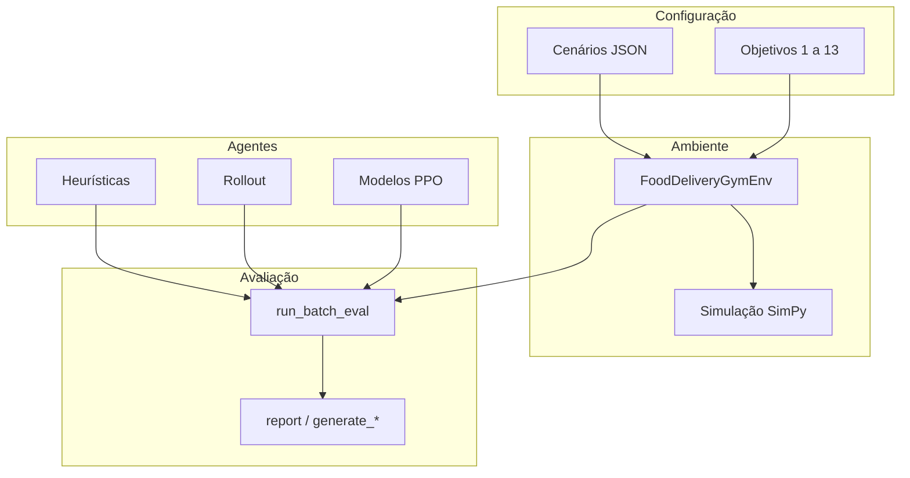

# Visão geral do framework

O Food Delivery Gym combina um simulador de eventos discretos (SimPy) com a API Gymnasium, permitindo treinar e avaliar políticas de alocação de motoristas.

## Arquitetura em camadas



| Camada | Responsabilidade | Local principal |
|--------|------------------|-----------------|
| Cenários | Parâmetros da cidade, demanda e frota | `food_delivery_gym/main/scenarios/*.json` |
| Ambiente | Observação, ação e recompensa | `food_delivery_gym/main/environment/` |
| Otimizadores | Escolha do motorista | `food_delivery_gym/main/optimizer/` |
| Estatísticas | Métricas e persistência | `food_delivery_gym/main/statistics/` |
| Avaliação | Experimentos nomeados | `food_delivery_gym/main/eval/` |
| Scripts | CLI de uso | `scripts/` |

## Ambiente Gymnasium

Ao importar `food_delivery_gym`, cada combinação de cenário e objetivo é registrada como:

```
FoodDelivery-{cenário}-obj{N}-v1
```

Exemplos: `FoodDelivery-medium-obj3-v1`, `FoodDelivery-simple-obj1-v1`.

- **Observação:** dicionário (`Dict`), adequada a `MultiInputPolicy` no PPO
- **Ação:** `Discrete(num_drivers)`, ou seja, o índice do motorista escolhido
- **Modos internos:** `TESTING`, `TRAINING`, `EVALUATING`

## Fluxo típico de uso

1. Escolher ou criar um cenário JSON.
2. Escolher um objetivo de recompensa (1 a 13).
3. Executar um agente via `test_runner` (debug) ou `run_batch_eval` (experimento).
4. Gerar relatório com `report` ou scripts `generate_*`.

Para treinar PPO, o fluxo passa pelo [RL Baselines3 Zoo](../rl-baselines3-zoo/README.md) e depois retorna a este repositório para avaliação.

## Documentação relacionada

- [Cenários](scenarios.md)
- [Objetivos de recompensa](reward-objectives.md)
- [Otimizadores](optimizers.md)
- [Catálogo de otimizadores](optimizer-catalog.md)
- [Layout de dados](../experiments/data-layout.md)
