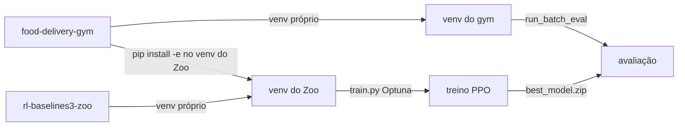

# RL Baselines3 Zoo

O treinamento oficial de agentes PPO usa o fork [MarquinhoCF/rl-baselines3-zoo](https://github.com/MarquinhoCF/rl-baselines3-zoo), baseado no [RL Baselines3 Zoo](https://github.com/DLR-RM/rl-baselines3-zoo).

Este repositório (`food-delivery-gym`) fornece o **ambiente Gymnasium** e a **avaliação** no simulador. O fork do Zoo fornece **treino**, **Optuna** e utilitários de hiperparâmetros.

## Dois repositórios, dois ambientes

Não há submódulo Git ligando os projetos. Clone-os lado a lado e use **dois ambientes virtuais separados**: um no gym (simulação e avaliação) e outro no Zoo (treino).

```
projetos/
  food-delivery-gym/
    venv/                 # simulação, run_batch_eval, report
  rl-baselines3-zoo/
    venv/                 # train.py, Optuna
```



| Papel | Repositório | Venv |
|-------|-------------|------|
| Registro dos envs `FoodDelivery-*` | food-delivery-gym | gym e Zoo (`pip install -e .` em cada um) |
| `train.py`, Optuna, `hyperparams/ppo.yml` | fork rl-baselines3-zoo | venv do Zoo |
| Avaliação científica (heurísticas vs PPO) | food-delivery-gym (`run_batch_eval`) | venv do gym |
| Eval genérica SB3 (`enjoy.py`) | fork (não é o fluxo do artigo) | venv do Zoo |

A instalação completa dos dois projetos (incluindo o venv do Zoo) está apenas em:

- **[Instalação, seção 7](../getting-started/installation.md#7-treinamento-com-rl-baselines3-zoo)**

## Guias desta seção

1. [Instalação](../getting-started/installation.md#7-treinamento-com-rl-baselines3-zoo): gym + Zoo (fonte única)
2. [Ajuste de hiperparâmetros](hyperparameter-tuning.md): Optuna
3. [Treinamento](training.md): treino final e curvas
4. [Artefatos](artifacts.md): layout de modelos e uso na avaliação
5. [Problemas comuns](troubleshooting.md)

## Pré-requisito

Defina cenário e objetivo antes de treinar. Consulte [Cenários](../framework/scenarios.md) e [Objetivos](../framework/reward-objectives.md).

IDs de ambiente:

```
FoodDelivery-{cenário}-obj{N}-v1
```

Exemplo: `FoodDelivery-medium-obj3-v1`.
