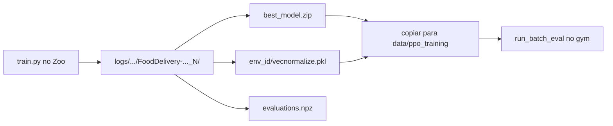

# Artefatos de treinamento e avaliação

Este guia explica o que o RL Baselines3 Zoo grava ao treinar, o layout que o `food-delivery-gym` espera para descobrir modelos, e como copiar os arquivos de um lado para o outro.

## Como o Zoo gera os arquivos

Os comandos de treino e Optuna rodam na raiz do fork `rl-baselines3-zoo`, com o **venv do Zoo** ativo. O destino principal é o `--log-folder` (por exemplo `logs/training/`).

### Treino final (`train.py`)

Exemplo:

```bash
python train.py \
  --algo ppo \
  --env FoodDelivery-medium-obj3-v1 \
  --n-timesteps 18000000 \
  --log-folder logs/training/
```

O Zoo cria uma pasta por execução no formato:

```
logs/training/ppo/FoodDelivery-medium-obj3-v1_1/
```

O sufixo `_1`, `_2`, … incrementa a cada nova execução do mesmo algoritmo e ambiente.

Conteúdo típico dessa pasta:

| Arquivo / pasta | Origem | Uso |
|-----------------|--------|-----|
| `best_model.zip` | Checkpoint com melhor desempenho na avaliação periódica do Zoo | Política carregada pelo framework |
| `FoodDelivery-medium-obj3-v1.zip` | Modelo final ao término do treino | Alternativa ao `best_model`; o framework prioriza `best_model.zip` |
| `evaluations.npz` | Avaliações feitas a cada `--eval-freq` | Curvas e inspeção pós-treino |
| `0.monitor.csv`, `1.monitor.csv`, … | Um arquivo por ambiente paralelo (`n_envs`) | Recompensa e comprimento por episódio |
| `FoodDelivery-medium-obj3-v1/` | Subpasta com metadados do run | Contém `vecnormalize.pkl`, `args.yml`, `config.yml`, `command.txt` |
| `FoodDelivery-medium-obj3-v1/vecnormalize.pkl` | Salvo quando `normalize: true` no YAML do PPO | Normalização de observação (e, no treino, de recompensa) |

O `vecnormalize.pkl` **não** fica na raiz do experimento: o Zoo o grava dentro da subpasta com o nome do env. O `food-delivery-gym` procura esse arquivo de forma recursiva sob a pasta do modelo (`find_vecnormalize`).

### Ajuste de hiperparâmetros (Optuna)

Com `--optimize-hyperparameters`, o Zoo grava trials em algo como:

```
logs/ppo/FoodDelivery-medium-obj3-v1_2/
  optimization/
    trial_0/
    trial_1/
    ...
  report_*.csv
  report_*.pkl
```

Cada `trial_N/` também pode conter `best_model.zip` e `evaluations.npz`. Esses artefatos servem ao [extract_best_trial](hyperparameter-tuning.md) e à inspeção do estudo; o layout de avaliação do artigo usa sobretudo os treinos finais de 18M passos sob `treinamento/`.

### Diagrama do fluxo



## Layout esperado pelo food-delivery-gym

A descoberta automática (`discover_rl_models`) varre:

```
<data/ppo_training>/<cenário>/treinamento/obj_<N>/<nome>/best_model.zip
```

O padrão de `--model-base-dir` é `./data/ppo_training/`. Exemplo:

```
data/ppo_training/
├── medium/
│   └── treinamento/
│       ├── obj_1/
│       │   ├── 18M_steps/
│       │   │   ├── best_model.zip
│       │   │   └── FoodDelivery-medium-obj1-v1/
│       │   │       └── vecnormalize.pkl
│       │   └── 18M_steps_otimizado/
│       │       └── ...
│       └── obj_3/
│           └── ...
├── simple/
│   └── treinamento/
│       └── ...
└── complex/
    └── treinamento/
        └── ...
```

Regras:

- O **cenário** no caminho é o stem do JSON (`medium`, `simple`, `complex`), não o ID Gymnasium completo.
- A pasta intermediária fixa é `treinamento/` (valor de `DEFAULT_MODEL_SUBDIR`).
- `obj_N` corresponde ao objetivo de recompensa (ex.: `obj_3`).
- Qualquer subpasta de `obj_N/` que contenha `best_model.zip` na raiz é um modelo.
- O **nome da pasta** (`18M_steps`, `18M_steps_otimizado`, …) identifica o agente; o catálogo também aceita a chave com prefixo de algoritmo (`ppo_18M_steps`).
- O `vecnormalize.pkl` pode ficar em qualquer subpasta do modelo; se não existir, o modelo roda sem normalização.

## Organizando os arquivos após o treino

O Zoo **não** grava diretamente em `data/ppo_training/`. Depois do treino, copie (ou mova) a pasta do experimento para o layout acima. Ajuste os caminhos se o Zoo e o gym não estiverem lado a lado.

### Exemplo: treino padrão em `medium`, objetivo 3

Suponha que o Zoo gerou:

```
../rl-baselines3-zoo/logs/training/ppo/FoodDelivery-medium-obj3-v1_1/
```

No `food-delivery-gym`:

```bash
# Crie a árvore de destino
mkdir -p data/ppo_training/medium/treinamento/obj_3

# Copie o experimento inteiro e dê um nome estável ao modelo
cp -a ../rl-baselines3-zoo/logs/training/ppo/FoodDelivery-medium-obj3-v1_1 \
  data/ppo_training/medium/treinamento/obj_3/18M_steps
```

Verifique se `best_model.zip` está na raiz da pasta do modelo e se o `vecnormalize.pkl` veio junto (em geral dentro de `FoodDelivery-medium-obj3-v1/`):

```bash
ls data/ppo_training/medium/treinamento/obj_3/18M_steps/best_model.zip
find data/ppo_training/medium/treinamento/obj_3/18M_steps -name vecnormalize.pkl
```

### Exemplo: treino com hiperparâmetros otimizados

Use outro nome de pasta para não sobrescrever o modelo padrão:

```bash
cp -a ../rl-baselines3-zoo/logs/training/ppo/FoodDelivery-medium-obj3-v1_2 \
  data/ppo_training/medium/treinamento/obj_3/18M_steps_otimizado
```

### Vários cenários

Repita o mesmo padrão trocando o cenário no caminho de destino e o prefixo do env no log do Zoo:

```bash
# simple, obj 3
mkdir -p data/ppo_training/simple/treinamento/obj_3
cp -a ../rl-baselines3-zoo/logs/training/ppo/FoodDelivery-simple-obj3-v1_1 \
  data/ppo_training/simple/treinamento/obj_3/18M_steps

# complex, obj 3
mkdir -p data/ppo_training/complex/treinamento/obj_3
cp -a ../rl-baselines3-zoo/logs/training/ppo/FoodDelivery-complex-obj3-v1_1 \
  data/ppo_training/complex/treinamento/obj_3/18M_steps
```

### O que precisa ir na pasta do modelo

O mínimo para o framework carregar o agente:

1. `best_model.zip` na raiz de `<nome>/`
2. `vecnormalize.pkl` em alguma subpasta de `<nome>/` (recomendado, se o treino usou `normalize: true`)

Arquivos como `*.monitor.csv`, `evaluations.npz`, `args.yml` e `config.yml` podem permanecer na cópia (úteis para auditoria), mas não são obrigatórios para `run_batch_eval`.

## Avaliação no simulador

Não confunda com `enjoy.py` do Zoo. O fluxo do framework é:

```bash
# No food-delivery-gym, com o venv do gym ativo
python -m scripts.run_batch_eval experiments/example.yaml
python -m scripts.report data/runs/experimento_exemplo
```

Modos de seleção de modelo:

| Modo | Efeito |
|------|--------|
| `same_scenario` | Usa o modelo do próprio cenário de avaliação |
| `cross_scenario` | Aplica o modelo de `--train-scenario` em todos os cenários |

Debug rápido com caminho explícito:

```bash
python -m scripts.test_runner --mode agent --optimizer rl \
  --model-path data/ppo_training/medium/treinamento/obj_3/18M_steps/best_model.zip
```

Ou pelo nome descoberto (com modelos já organizados sob `data/ppo_training/`):

```bash
python -m scripts.test_runner --mode agent --optimizer ppo_18M_steps --objective 3
```

Consulte também [Layout de dados](../experiments/data-layout.md), [Treinamento](training.md) e [run_batch_eval](../tools/run-batch-eval.md).
